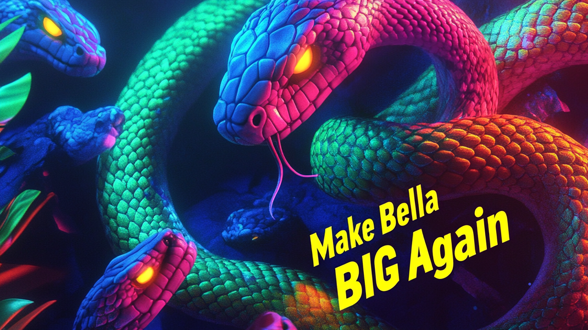

# GTOAT 3.0 — Greatest Team Of All Time

Award-tier 3D rebuild of [gtoat.com](https://gtoat.com). One signature idea executed with
restraint: a living neon serpent slithering through a classified dossier. Slither.io made mythic.



## Experience

- **The Serpent** — procedural CatmullRom spine, zero-allocation tube body, custom GLSL
  (iridescent ramp, flowing glow bands, fresnel rim), pointer-seeking head with
  pupil-tracking eyes. It eats the orb field as you scroll.
- **The Stage** — FBM nebula shader with scroll-driven hue journey, selective bloom
  (one effect, tuned hard), camera parallax rig, single `gsap.ticker` heartbeat driving
  Lenis + render loop.
- **The Dossier** — every line of 2.x copy preserved: the roster warning labels, the
  6-era lore, Bella doctrine, the rickroll, the hidden footer links.
- **GRINCH.io** — the original playable slither engine, lazy-loaded on play.

## Stack

Vite 6 · TypeScript · Three.js · GSAP ScrollTrigger · Lenis · postprocessing ·
Supabase · EmailJS

## Develop

```sh
npm install
npm run dev      # http://localhost:5173
npm run build    # typecheck + dist/
npm run preview
```

## Structure

```
index.html        the dossier (single page)
hs.html  al.html  private dashboards (Supabase: highscores / activity_logs)
src/engine/       renderer, camera, quality tiers, ticker heartbeat
src/serpent/      spine, body, head — the star
src/fx/           nebula, orbs, bloom
src/sections/     reveals, choreography, interactions
src/data/         game loader, EmailJS contact
public/game/      original GRINCH.io engine (verbatim)
docs/             MASTER_PLAN.md, CONTENT_INVENTORY.md
```

## Performance

Quality tiers auto-detected (memory/cores/touch): DPR cap, bloom gate, geometry and
orb budgets. `prefers-reduced-motion` freezes time-driven animation. ~5 draw calls
for the full 3D stage; JS ≈ 198 KB gzipped.

## Deploy

Static `dist/` — any host. `vercel --prod` or point a static host at the build output.
